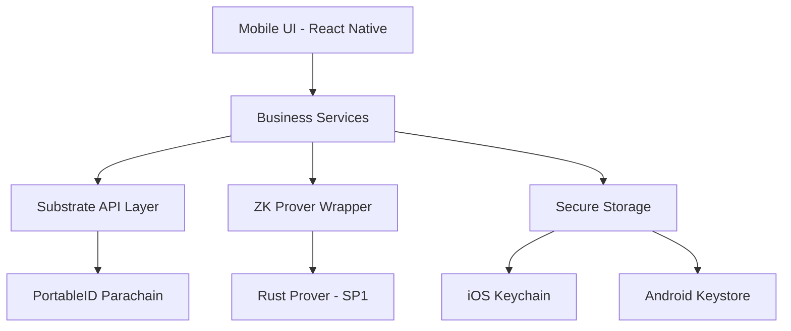

# PortableID Mobile Application: Technical Documentation

## 1. Introduction

The PortableID Mobile Application is a self-sovereign identity (SSI) wallet built with React Native and Expo. It allows users to manage their Decentralized Identifiers (DIDs), store Verifiable Credentials (VCs), and generate Zero-Knowledge Proofs (ZKPs) locally on their device using a high-performance Rust-based prover.

## 2. Architecture Overview

The mobile application follows a modular architecture that separates UI components, business logic, and low-level cryptographic operations.

### 2.1 Technology Stack

- **Framework**: React Native with Expo (Managed Workflow)
- **Language**: TypeScript
- **Navigation**: Expo Router
- **State Management**: Redux Toolkit (thunks for async operations)
- **Blockchain Interface**: @polkadot/api
- **ZKP Prover**: SP1 (Succinct) via Rust Foreign Function Interface (FFI)
- **Styling**: NativeWind (Tailwind CSS for React Native)

### 2.2 Component Diagram

## 3. Core Modules

### 3.1 Substrate Integration (`src/substrate`)

The mobile app communicates with the PortableID parachain using `@polkadot/api`. The `SubstrateAPIService` manages connection state, subscriptions, and RPC calls.

- **`api.ts`**: Manages the `ApiPromise` instance and connection lifecycle.
- **`calls.ts`**: Encapsulates extrinsic submissions (e.g., `create_identity`, `issue_credential`).
- **`queries.ts`**: Handles on-chain data retrieval (e.g., fetching DIDs, checking credential status).
- **`utils.ts`**: Helper functions for address encoding and unit conversion.

### 3.2 ZK Proof Generation (`src/zk` & `rust-prover`)

PortableID uses a hybrid approach for proof generation. High-level orchestrations are done in TypeScript, while the heavy cryptographic computation is offloaded to a native Rust module.

#### Rust Prover (`mobile/rust-prover`)
The Rust prover utilizes the SP1 zkVM from Succinct to generate proofs.
- **`ffi.rs`**: Defines the C-compatible interface and JNI wrappers for cross-platform compatibility.
- **`proving/mod.rs`**: Core logic for generating proofs using provided circuit IDs and inputs.

#### TypeScript Wrapper (`src/zk`)
- **`prover.ts`**: Bridges the JavaScript environment with the native `ZKProverModule`.
- **`useProof.ts`**: React hook for managing proof generation state and UI feedback.

### 3.3 Crypto & Key Management (`src/services/crypto`)

Security is paramount. Private keys and sensitive biometric data never leave the device in an unencrypted state.

- **`keyManagement.ts`**: Interfaces with secure storage to manage DID private keys and mnemonic phrases.
- **`signature.ts`**: Handles message signing for extrinsic authentication.
- **`zk.ts`**: Prepares inputs for ZK proofs, including biometric nullifier generation.

## 4. User Flow & Features

### 4.1 Identity Creation
1. User generates a new mnemonic or imports an existing one.
2. The app derives a DID from the public key: `did:portableid:0x...`.
3. An extrinsic is submitted to the `pallet-identity-registry` to register the DID.

### 4.2 Credential Management
- **Receiving**: Users can scan QR codes to receive VCs from trusted issuers.
- **Storage**: Credentials are stored in an encrypted local database.
- **Verification**: Users can view the status and details of their credentials by querying the parachain.

### 4.3 Zero-Knowledge Proof Generation
When a verifier requests a proof (e.g., "Prove user is over 18"):
1. The app retrieves the relevant VC.
2. It extracts the necessary fields and generates a blinding factor.
3. The `rust-prover` generates a Groth16 or SP1 proof.
4. The proof is sent to the verifier or submitted on-chain for validation.

## 5. Security Model

- **Device-Side Proving**: No private data or biometric templates are sent to any server for proving.
- **Secure Storage**: Uses `expo-secure-store` which leverages the iOS Keychain and Android Keystore.
- **Biometric Authentication**: Access to the wallet and ZK-proving requires local biometric authentication (FaceID/TouchID/Fingerprint).
- **Network Privacy**: Communication with the parachain is done via encrypted WebSockets.

## 6. Development & Build

### 6.1 Requirements
- Node.js & npm/yarn
- Rust toolchain (for `rust-prover`)
- Android Studio / Xcode
- Expo CLI

### 6.2 Building the Native Module
The Rust prover must be compiled for each target platform:
- **Android**: `cargo ndk -t arm64-v8a -t x86_64 build`
- **iOS**: `cargo lipo --release`

The resulting binaries are linked to the React Native project via custom native modules (`ZKProverModule`).

---
*Documentation Version: 1.0.0*
