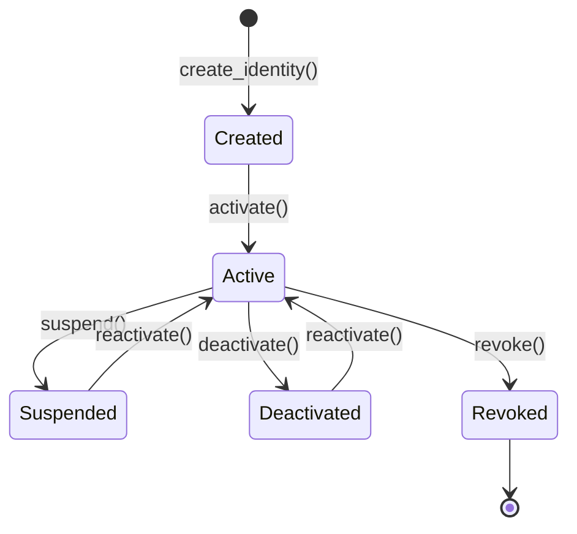

# PortableID Parachain: Comprehensive Technical Documentation

## Executive Summary

PortableID is a privacy-preserving decentralized identity parachain built on Polkadot that enables self-sovereign identity management with zero-knowledge proofs, verifiable credentials, on-chain governance, and cross-chain interoperability. This documentation covers the complete technical architecture, mathematical foundations, security model, and cross-chain expansion strategy.

---

## Table of Contents

1. [Core Concepts & Terminology](#1-core-concepts--terminology)
2. [Architecture Overview](#2-architecture-overview)
3. [Mathematical Foundations](#3-mathematical-foundations)
4. [Pallet Deep Dives](#4-pallet-deep-dives)
5. [Security Model](#5-security-model)
6. [Cross-Chain Architecture](#6-cross-chain-architecture)
7. [Consensus & Validation](#7-consensus--validation)
8. [Privacy Guarantees](#8-privacy-guarantees)
9. [Performance & Optimization](#9-performance--optimization)
10. [Governance & Economics](#10-governance--economics)
11. [Future Enhancements](#11-future-enhancements)

---

## 1. Core Concepts & Terminology

### 1.1 Fundamental Concepts

#### Decentralized Identifier (DID)
A globally unique identifier that enables verifiable, decentralized digital identity. In PortableID:
- **Format**: `did:portableid:<method-specific-id>`
- **Properties**: Self-sovereign, cryptographically verifiable, persistent
- **Storage**: On-chain DID Document with public keys and service endpoints

#### Verifiable Credential (VC)
A tamper-evident credential with cryptographic proofs issued by trusted entities:
```rust
pub struct Credential<T: Config> {
    pub subject: H256,           // DID of credential holder
    pub issuer: H256,            // DID of credential issuer
    pub credential_type: CredentialType,
    pub data_hash: H256,         // Hash of encrypted credential data
    pub issued_at: u64,
    pub expires_at: u64,
    pub status: CredentialStatus,
    pub signature: H256,         // Issuer's signature
    pub metadata_hash: H256,
    pub fields: BoundedVec<...>,
    pub required_fields: BoundedVec<bool, ...>,
}
```

#### Zero-Knowledge Proof (ZKP)
Cryptographic method enabling one party to prove possession of information without revealing the information itself:
- **Proof System**: Groth16 over BN254 curve
- **Properties**: Succinct, non-interactive, publicly verifiable
- **Use Cases**: Selective disclosure, age verification, credential validation

#### Nullifier
A cryptographic commitment derived from biometric data that ensures uniqueness without revealing the biometric:
```
nullifier = H(biometric_template)
commitment = H(biometric_template || salt)
```

---

### 1.2 Key Terminology

| Term | Definition | Example |
|------|------------|---------|
| **DID Document** | JSON-LD document containing public keys, authentication methods, and service endpoints | `{ "id": "did:portableid:123", "publicKey": [...] }` |
| **Selective Disclosure** | Revealing only specific credential fields while hiding others | Proving age ≥21 without revealing birthdate |
| **Trusted Issuer** | Entity authorized by governance to issue specific credential types | University issuing education credentials |
| **Proof of Personhood** | Cryptographic proof that an entity is a unique human without revealing identity | Biometric nullifier verification |
| **Cross-Chain Bridge** | Mechanism for transferring credentials/proofs across blockchain networks | Polkadot ↔ Ethereum credential verification |
| **Guardian** | Trusted contact for social recovery of lost identity | Family member approving account recovery |
| **ML Oracle** | Off-chain machine learning service providing behavioral biometric scoring | Typing pattern analysis service |

---

### 1.3 Credential Types

```rust
pub enum CredentialType {
    Education,      // Academic credentials (degrees, certificates)
    Health,         // Medical records, vaccination status
    Employment,     // Work history, professional licenses
    Age,            // Age verification tokens
    Address,        // Residence verification
    Custom,         // Application-specific credentials
}
```

---

### 1.4 Identity Lifecycle States



---

## 2. Architecture Overview

### 2.1 System Architecture

```
┌─────────────────────────────────────────────────────────────────┐
│                     Polkadot Relay Chain                        │
│  (Shared Security, Cross-Chain Message Passing, Finality)       │
└─────────────────────────────────────────────────────────────────┘
                              │
        ┌─────────────────────┼─────────────────────┐
        │                     │                     │
        ▼                     ▼                     ▼
   ┌──────────┐       ┌─────────────┐       ┌──────────┐
   │Parachain │       │ PortableID  │       │  Other   │
   │    A     │◄─────►│  Parachain  │◄─────►│Parachains│
   └──────────┘       └─────────────┘       └──────────┘
                             │
        ┌────────────────────┼────────────────────┐
        │                    │                    │
        ▼                    ▼                    ▼
   ┌─────────────┐  ┌──────────────┐  ┌──────────────┐
   │   Mobile    │  │     Web      │  │   External   │
   │   Wallet    │  │   Portal     │  │  Blockchains │
   │  (User DID) │  │  (Issuers)   │  │(Eth/Sol/Sui) │
   └─────────────┘  └──────────────┘  └──────────────┘
```

### 2.2 Parachain Runtime Structure

```
PortableID Runtime (lib.rs)
│
├── System Pallets (FRAME)
│   ├── frame_system
│   ├── pallet_balances
│   ├── pallet_timestamp
│   ├── pallet_transaction_payment
│   └── pallet_sudo
│
├── Consensus Pallets
│   ├── cumulus_pallet_aura_ext
│   ├── cumulus_pallet_parachain_system
│   └── pallet_session
│
├── XCM Configuration
│   ├── xcm_executor
│   ├── xcm_builder
│   └── pallet_xcm
│
└── PortableID Custom Pallets
    ├── pallet-identity-registry (Core DID management)
    ├── pallet-verifiable-credentials (VC issuance & verification)
    ├── pallet-zk-credentials (ZKP verification)
    ├── pallet-credential-governance (Issuer approval voting)
    ├── pallet-xcm-credentials (Cross-parachain credentials)
    └── pallet-proof-of-personhood (Biometric nullifiers & recovery)
```

### 2.3 Data Flow Architecture

#### DID Creation Flow
```
User → create_identity(did, public_key)
  ↓
Identity Registry Pallet
  ├─ Validate DID format (W3C compliant)
  ├─ Check uniqueness (DID hash)
  ├─ Hash DID → did_hash = blake2_256(did)
  ├─ Store Identity { controller, public_key, created_at, active }
  ├─ Create DID Document (public keys, authentication methods)
  └─ Emit IdentityCreated event
```

#### Credential Issuance Flow
```
Issuer → issue_credential(subject_did, credential_type, data_hash, signature)
  ↓
Verifiable Credentials Pallet
  ├─ Verify issuer identity exists & active
  ├─ Verify subject identity exists & active
  ├─ Check issuer trust: TrustedIssuers[credential_type][issuer_did]
  ├─ Validate expiration timestamp
  ├─ Generate credential_id = blake2_256([subject, issuer, data_hash, timestamp])
  ├─ Store Credential in Credentials[credential_id]
  ├─ Update CredentialsOf[subject_did].push(credential_id)
  ├─ Update IssuedBy[issuer_did].push(credential_id)
  ├─ Schedule expiration: Expiries[expiry_block].push(credential_id)
  └─ Emit CredentialIssued event
```

#### ZK Proof Verification Flow
```
User → verify_proof(ZkProof { proof_type, proof_data, public_inputs, ... })
  ↓
ZK Credentials Pallet
  ├─ Get verification key: VerifyingKeys[proof_type]
  ├─ Check replay: NOT VerifiedProofs[proof_hash]
  ├─ Deserialize VK: VerifyingKey<Bn254>::deserialize(vk_data)
  ├─ Prepare VK: pvk = prepare_verifying_key(&vk)
  ├─ Deserialize Proof: Proof<Bn254>::deserialize(proof_data)
  ├─ Convert public inputs to field elements: Fr::from_be_bytes_mod_order(input)
  ├─ Execute Groth16 verification: verify_proof(&pvk, &proof, &inputs)
  ├─ Store in VerifiedProofs[proof_hash] = (caller, timestamp)
  └─ Emit ProofVerified event
```

---

## 3. Mathematical Foundations

### 3.1 Cryptographic Primitives

#### Hash Functions
**Blake2-256**: Primary hash function for DID generation, credential IDs, nullifiers
```
H: {0,1}* → {0,1}^256
Properties: Collision-resistant, preimage-resistant, second-preimage-resistant
```

**Usage Examples**:
```rust
// DID hashing
did_hash = blake2_256(did_string)

// Nullifier generation
nullifier = blake2_256(biometric_template)

// Commitment scheme
commitment = blake2_256(biometric_template || salt)

// Credential ID
credential_id = blake2_256(subject || issuer || data_hash || timestamp)
```

#### Digital Signatures
**Supported Schemes**:
- **Ed25519**: Edwards-curve Digital Signature Algorithm
- **Sr25519**: Schnorr signature on Ristretto 255
- **ECDSA**: Elliptic Curve Digital Signature Algorithm

**Signature Verification**:
```rust
fn verify_signature(
    message: &[u8],
    signature: &Signature,
    public_key: &PublicKey
) -> bool {
    match signature_scheme {
        Ed25519 => ed25519_verify(signature, message, public_key),
        Sr25519 => sr25519_verify(signature, message, public_key),
        ECDSA => ecdsa_verify(signature, message, public_key),
    }
}
```

---

### 3.2 Zero-Knowledge Proofs (Groth16)

#### Mathematical Foundation

**Groth16** is a zk-SNARK construction providing:
- **Succinct proofs**: Constant size (~200 bytes)
- **Fast verification**: O(1) verification time
- **Non-interactive**: No back-and-forth communication

**Elliptic Curve**: BN254 (Barreto-Naehrig curve at 254-bit security)
```
E: y² = x³ + 3 over F_p
p = 21888242871839275222246405745257275088696311157297823662689037894645226208583
```

**Pairing Function**:
```
e: G₁ × G₂ → G_T
Properties: Bilinearity, Non-degeneracy, Computability
```

#### Proof Structure

**Public Parameters**:
- **Common Reference String (CRS)**: Generated via trusted setup
- **Verification Key (VK)**: Public parameters for verification
- **Proving Key (PK)**: Private parameters for proof generation

**Proof Elements**:
```
π = (A, B, C) where:
A ∈ G₁
B ∈ G₂  
C ∈ G₁
```

**Verification Equation**:
```
e(A, B) = e(α, β) · e(C, δ) · e(∑ᵢ public_inputᵢ · γᵢ, γ)
```

#### Implementation in PortableID

```rust
// Verification key storage
pub struct VerificationKeyData {
    pub proof_type: ProofType,
    pub vk_data: BoundedVec<u8, ConstU32<2048>>,  // Serialized VK
    pub registered_by: H256,
    pub registered_at: u64,
}

// Proof verification
pub fn verify_proof_internal(proof: &ZkProof) -> Result<(), Error<T>> {
    // 1. Get verification key
    let vk_data = VerifyingKeys::<T>::get(&proof.proof_type)?;
    
    // 2. Deserialize VK (compressed format)
    let vk = VerifyingKey::<Bn254>::deserialize_compressed(&vk_data.vk_data[..])?;
    
    // 3. Prepare VK for efficient verification
    let pvk = prepare_verifying_key(&vk);
    
    // 4. Deserialize proof
    let groth16_proof = Proof::<Bn254>::deserialize_compressed(&proof.proof_data[..])?;
    
    // 5. Convert public inputs to field elements
    let inputs: Vec<Fr> = proof.public_inputs
        .iter()
        .map(|input| Fr::from_be_bytes_mod_order(input))
        .collect();
    
    // 6. Execute pairing-based verification
    let valid = Groth16::<Bn254>::verify_proof(&pvk, &groth16_proof, &inputs)?;
    
    ensure!(valid, Error::<T>::ProofVerificationFailed);
    Ok(())
}
```

---

### 3.3 Selective Disclosure Mathematics

#### Commitment Scheme

**Pedersen Commitment**:
```
C = g^m · h^r
where:
- g, h: Group generators (nothing-up-my-sleeve points)
- m: Message (credential field)
- r: Random blinding factor
- C: Commitment
```

**Properties**:
- **Binding**: Cannot change m after committing
- **Hiding**: C reveals nothing about m without r

#### Merkle Tree for Credential Fields

```
         Root Hash
        /         \
    H(F₁||F₂)   H(F₃||F₄)
    /    \      /    \
  H(F₁) H(F₂) H(F₃) H(F₄)
   |     |     |     |
  Field1 Field2 Field3 Field4
```

**Selective Disclosure Protocol**:
1. User computes root hash of all credential fields
2. User reveals selected fields + Merkle proofs
3. Verifier validates: `MerkleVerify(revealed_fields, proof, root_hash)`
4. ZK proof shows: `"I know all fields such that root matches"`

---

### 3.4 Proof of Personhood Mathematics

#### Biometric Nullifier Generation

**Problem**: Ensure one person = one identity without storing biometrics

**Solution**: Cryptographic nullifier
```
Template Extraction: biometric_raw → feature_vector ∈ ℝⁿ
Normalization: v = normalize(feature_vector)
Hashing: nullifier = H(v)
Commitment: commitment = H(v || salt)
```

**Security Properties**:
- **Unlinkability**: H(v₁) and H(v₁) with different salts are unlinkable
- **Collision Resistance**: Different people have different nullifiers (high probability)
- **Non-reversibility**: Cannot recover v from H(v)

#### Cross-Biometric Binding

**Proving Multiple Biometrics Belong to Same Person**:

```
Public Inputs:
- nullifier_A = H(bio_A)
- nullifier_B = H(bio_B)
- session_id (prevents replay)

Private Inputs:
- bio_A (fingerprint)
- bio_B (iris)
- capture_timestamp

ZK Circuit:
1. Verify: H(bio_A) = nullifier_A
2. Verify: H(bio_B) = nullifier_B
3. Verify: liveness_check(bio_A) = true
4. Verify: liveness_check(bio_B) = true
5. Verify: temporal_proximity(bio_A_timestamp, bio_B_timestamp) < 5min
6. Output: ✓ (no other information revealed)
```

---

### 3.5 Behavioral Biometrics Statistics

#### Feature Vector

```
F = [typing_speed, key_hold_time, transition_time, error_rate, pattern_hash, hour_preference]
```

#### Statistical Envelope (2-Sigma Bounds)

**Welford's Online Algorithm** for mean and variance:
```
For sample x_n:
  δ = x_n - μₙ₋₁
  μₙ = μₙ₋₁ + δ/n
  M2ₙ = M2ₙ₋₁ + δ·(x_n - μₙ)
  σ² = M2ₙ/(n-1)
```

**95% Confidence Interval**:
```
[μ - 2σ, μ + 2σ]
```

**Acceptance Criterion**:
```
Accept sample x if:
  ∀ feature i: μᵢ - 2σᵢ ≤ xᵢ ≤ μᵢ + 2σᵢ
```

#### Weighted Distance Metric

```
D(F_current, F_stored) = √(Σᵢ wᵢ·(fᵢ_current - fᵢ_stored)²)

Weights (total = 100):
- typing_speed: 15
- key_hold_time: 20
- transition_time: 30  (most discriminative)
- error_rate: 10
- pattern_hash: 15
- time_preference: 10
```

**Confidence Score**:
```
confidence = 100 - min(D, 100)
Time decay factor: decay = exp(-age/90_days)
Final confidence = confidence · decay
```

---

## 4. Pallet Deep Dives

### 4.1 Pallet: Identity Registry

**Purpose**: Core DID management - creation, updates, deactivation, reactivation

#### Storage Items

```rust
/// Maps DID hash to Identity struct
pub type Identities<T: Config> = StorageMap
    Blake2_128Concat,
    H256,              // DID hash
    Identity<T>,       // Identity data
    OptionQuery
>;

/// Maps AccountId to their DID hash
pub type AccountDids<T: Config> = StorageMap
    Blake2_128Concat,
    T::AccountId,
    H256,
    OptionQuery
>;

/// DID Documents (W3C standard)
pub type DidDocuments<T: Config> = StorageMap
    Blake2_128Concat,
    H256,
    DidDocument,
    OptionQuery
>;
```

#### Identity Structure

```rust
pub struct Identity<T: Config> {
    pub controller: T::AccountId,  // Account controlling this DID
    pub public_key: H256,           // Primary public key
    pub created_at: u64,            // Unix timestamp
    pub updated_at: u64,
    pub active: bool,               // Can be deactivated
}
```

#### DID Document Structure (W3C Compliant)

```rust
pub struct DidDocument {
    pub did: BoundedVec<u8, ConstU32<64>>,                    // "did:portableid:..."
    pub public_keys: BoundedVec<H256, ConstU32<16>>,          // Multiple keys
    pub authentication: BoundedVec<H256, ConstU32<16>>,       // Auth methods
    pub services: BoundedVec<BoundedVec<u8, ConstU32<128>>, ConstU32<8>>,  // Service endpoints
}
```

#### Key Functions

**1. create_identity**
```rust
pub fn create_identity(
    origin: OriginFor<T>,
    did: Vec<u8>,           // e.g., "did:portableid:alice123"
    public_key: H256,
) -> DispatchResult {
    let who = ensure_signed(origin)?;
    
    // Validation
    ensure!(validate_did_format(&did), Error::<T>::InvalidDidFormat);
    ensure!(validate_public_key(&public_key), Error::<T>::InvalidPublicKey);
    ensure!(!AccountDids::<T>::contains_key(&who), Error::<T>::AccountAlreadyHasIdentity);
    
    // Hash DID
    let did_hash = blake2_256(&did).into();
    ensure!(!Identities::<T>::contains_key(&did_hash), Error::<T>::IdentityAlreadyExists);
    
    // Create identity
    let identity = Identity {
        controller: who.clone(),
        public_key,
        created_at: now(),
        updated_at: now(),
        active: true,
    };
    
    // Create DID document
    let did_document = DidDocument {
        did: did.try_into()?,
        public_keys: vec![public_key].try_into()?,
        authentication: vec![public_key].try_into()?,
        services: BoundedVec::default(),
    };
    
    // Store
    Identities::<T>::insert(&did_hash, identity);
    AccountDids::<T>::insert(&who, did_hash);
    DidDocuments::<T>::insert(&did_hash, did_document);
    
    Self::deposit_event(Event::IdentityCreated { did_hash, controller: who });
    Ok(())
}
```

**DID Format Validation**:
```rust
fn validate_did_format(did: &[u8]) -> bool {
    // Format: did:<method>:<method-specific-id>
    if did.len() < 7 || did.len() > 255 { return false; }
    if !did.starts_with(b"did:") { return false; }
    
    // Valid characters: alphanumeric, dash, underscore, colon
    for byte in did {
        match byte {
            b'a'..=b'z' | b'0'..=b'9' | b'-' | b'_' | b':' => {},
            _ => return false,
        }
    }
    
    // Must have at least one colon after "did:"
    did.iter().skip(4).any(|&b| b == b':')
}
```

**2. update_identity**
```rust
pub fn update_identity(
    origin: OriginFor<T>,
    new_public_key: H256,
) -> DispatchResult {
    let who = ensure_signed(origin)?;
    let did_hash = AccountDids::<T>::get(&who).ok_or(Error::<T>::IdentityNotFound)?;
    
    Identities::<T>::try_mutate(&did_hash, |identity_opt| {
        let identity = identity_opt.as_mut().ok_or(Error::<T>::IdentityNotFound)?;
        ensure!(identity.controller == who, Error::<T>::NotController);
        ensure!(identity.active, Error::<T>::IdentityInactive);
        
        identity.public_key = new_public_key;
        identity.updated_at = now();
        
        Ok(())
    })
}
```

**3. deactivate_identity & reactivate_identity**
```rust
pub fn deactivate_identity(origin: OriginFor<T>) -> DispatchResult {
    let who = ensure_signed(origin)?;
    let did_hash = AccountDids::<T>::get(&who).ok_or(Error::<T>::IdentityNotFound)?;
    
    Identities::<T>::try_mutate(&did_hash, |identity_opt| {
        let identity = identity_opt.as_mut().ok_or(Error::<T>::IdentityNotFound)?;
        ensure!(identity.controller == who, Error::<T>::NotController);
        
        identity.active = false;
        identity.updated_at = now();
        Ok(())
    })
}
```

---

### 4.2 Pallet: Verifiable Credentials

**Purpose**: Issue, revoke, verify, and selectively disclose verifiable credentials

#### Storage Items

```rust
/// All credentials by ID
pub type Credentials<T: Config> = StorageMap
    Blake2_128Concat,
    H256,              // credential_id
    Credential<T>,
    OptionQuery
>;

/// Credentials owned by a subject
pub type CredentialsOf<T: Config> = StorageMap
    Blake2_128Concat,
    H256,              // subject DID hash
    BoundedVec<H256, ConstU32<1000>>,  // List of credential IDs
    ValueQuery
>;

/// Credentials issued by an issuer
pub type IssuedBy<T: Config> = StorageMap
    Blake2_128Concat,
    H256,              // issuer DID hash
    BoundedVec<H256, ConstU32<10000>>,
    ValueQuery
>;

/// Trusted issuers per credential type
pub type TrustedIssuers<T: Config> = StorageMap
    Blake2_128Concat,
    (CredentialType, H256),  // (type, issuer_did)
    bool,
    ValueQuery
>;

/// Credential schemas
pub type Schemas<T: Config> = StorageMap
    Blake2_128Concat,
    H256,              // schema_id
    CredentialSchema,
    OptionQuery
>;

/// Expiry tracking (for automatic cleanup)
pub type Expiries<T: Config> = StorageMap
    Blake2_128Concat,
    u64,               // Block number
    BoundedVec<H256, ConstU32<50>>,  // Credentials expiring at this block
    ValueQuery
>;

/// Selective disclosure records
pub type DisclosureRecords<T: Config> = StorageMap
    Blake2_128Concat,
    H256,              // disclosure_id
    SelectiveDisclosureRequest,
    OptionQuery
>;
```

#### Credential Structure

```rust
pub struct Credential<T: Config> {
    pub subject: H256,                   // Subject DID
    pub issuer: H256,                    // Issuer DID
    pub credential_type: CredentialType,
    pub data_hash: H256,                 // Hash of encrypted credential data
    pub issued_at: u64,
    pub expires_at: u64,                 // 0 = never expires
    pub status: CredentialStatus,        // Active, Revoked, Expired, Suspended
    pub signature: H256,                 // Issuer's signature
    pub metadata_hash: H256,
    pub fields: BoundedVec<BoundedVec<u8, MaxFieldSize>, MaxFields>,
    pub required_fields: BoundedVec<bool, MaxFields>,
    pub fields_to_reveal: BoundedVec<u32, MaxFieldsToReveal>,
}
```

#### Key Functions

**1. issue_credential**
```rust
pub fn issue_credential(
    origin: OriginFor<T>,
    subject_did: H256,
    credential_type: CredentialType,
    data_hash: H256,
    expires_at: u64,
    signature: H256,
    fields: Vec<Vec<u8>>,
    required_fields: Vec<bool>,
    fields_to_reveal: Vec<u32>,
) -> DispatchResult {
    let who = ensure_signed(origin)?;
    
    // 1. Verify issuer identity exists & active
    let (issuer_did, issuer_identity) = 
        IdentityRegistry::get_identity_by_account(&who)
            .ok_or(Error::<T>::IssuerIdentityNotFound)?;
    ensure!(issuer_identity.active, Error::<T>::IssuerInactive);
    
    // 2. Verify subject identity exists & active
    ensure!(
        IdentityRegistry::is_identity_active(&subject_did),
        Error::<T>::SubjectIdentityNotFound
    );
    
    // 3. Verify issuer is trusted for this credential type
    ensure!(
        TrustedIssuers::<T>::get((&credential_type, &issuer_did)),
        Error::<T>::IssuerNotTrusted
    );
    
    // 4. Validate expiration (reasonable timeframe)
    ensure!(
        validate_expiration_timestamp(expires_at),
        Error::<T>::InvalidCredentialStatus
    );
    
    // 5. Convert fields to BoundedVec
    let bounded_fields = fields.into_iter()
        .map(|f| f.try_into().map_err(|_| Error::<T>::FieldTooLarge))
        .collect::<Result<Vec<_>, _>>()?
        .try_into()
        .map_err(|_| Error::<T>::TooManyFields)?;
    
    let bounded_required = required_fields.try_into()
        .map_err(|_| Error::<T>::TooManyFields)?;
    
    let bounded_reveal = fields_to_reveal.try_into()
        .map_err(|_| Error::<T>::TooManyFieldsToReveal)?;
    
    // 6. Validate consistency
    ensure!(
        bounded_fields.len() == bounded_required.len(),
        Error::<T>::InvalidFieldsLength
    );
    
    // 7. Create credential
    let credential = Credential::<T> {
        subject: subject_did,
        issuer: issuer_did,
        credential_type: credential_type.clone(),
        data_hash,
        issued_at: now(),
        expires_at,
        status: CredentialStatus::Active,
        signature,
        metadata_hash: generate_metadata_hash(...),
        fields: bounded_fields,
        required_fields: bounded_required,
        fields_to_reveal: bounded_reveal,
    };
    
    // 8. Generate credential ID
    let credential_id = generate_credential_id(&credential);
    
    // 9. Store credential
    Credentials::<T>::insert(&credential_id, credential);
    CredentialsOf::<T>::try_mutate(&subject_did, |creds| {
        creds.try_push(credential_id)
    })?;
    IssuedBy::<T>::try_mutate(&issuer_did, |creds| {
        creds.try_push(credential_id)
    })?;
    
    // 10. Schedule expiration cleanup
    if expires_at > 0 {
        let expiry_block = expires_at / 6;  // Assuming 6s block time
        Expiries::<T>::try_mutate(expiry_block, |list| {
            list.try_push(credential_id)
        })?;
    }
    
    Self::deposit_event(Event::CredentialIssued {
        credential_
        id,
        subject: subject_did,
        issuer: issuer_did,
        credential_type,
    });
    
    Ok(())
}
```

**Credential ID Generation**:
```rust
fn generate_credential_id(credential: &Credential<T>) -> H256 {
    let mut data = Vec::new();
    data.extend_from_slice(credential.subject.as_bytes());
    data.extend_from_slice(credential.issuer.as_bytes());
    data.extend_from_slice(credential.data_hash.as_bytes());
    data.extend_from_slice(&credential.issued_at.to_le_bytes());
    blake2_256(&data).into()
}
```

**2. selective_disclosure**
```rust
pub fn selective_disclosure(
    origin: OriginFor<T>,
    credential_id: H256,
    fields_to_reveal: Vec<u32>,
    proof: H256,
) -> DispatchResult {
    let who = ensure_signed(origin)?;
    
    // 1. Get credential
    let credential = Credentials::<T>::get(&credential_id)
        .ok_or(Error::<T>::CredentialNotFound)?;
    
    // 2. Validate credential status
    ensure!(credential.status == CredentialStatus::Active, Error::<T>::CredentialRevoked);
    
    // 3. Validate fields
    ensure!(!fields_to_reveal.is_empty(), Error::<T>::NoFieldsToReveal);
    ensure!(
        validate_field_indices(&credential_id, &fields_to_reveal),
        Error::<T>::InvalidFieldIndices
    );
    ensure!(
        fields_to_reveal.len() <= 50,
        Error::<T>::TooManyFieldsRequested
    );
    
    // 4. Generate disclosure ID
    let disclosure_id = generate_disclosure_id(
        &credential_id,
        &fields_to_reveal,
        &proof,
        now(),
    );
    
    // 5. Check not already used (replay prevention)
    ensure!(
        !DisclosureRecords::<T>::contains_key(&disclosure_id),
        Error::<T>::ProofAlreadyUsed
    );
    
    // 6. Verify ZK proof
    verify_selective_disclosure_proof(
        &credential_id,
        &fields_to_reveal,
        &proof,
        &credential,
    )?;
    
    // 7. Verify issuer signature
    verify_credential_issuer_signature(&credential)?;
    
    // 8. Verify issuer still trusted
    ensure!(
        TrustedIssuers::<T>::get((&credential.credential_type, &credential.issuer)),
        Error::<T>::IssuerNotTrusted
    );
    
    // 9. Verify identities still active
    ensure!(
        IdentityRegistry::is_identity_active(&credential.issuer),
        Error::<T>::IssuerIdentityNotFound
    );
    ensure!(
        IdentityRegistry::is_identity_active(&credential.subject),
        Error::<T>::SubjectIdentityNotFound
    );
    
    // 10. Store disclosure record
    let disclosure_request = SelectiveDisclosureRequest {
        credential_id,
        fields_to_reveal: fields_to_reveal.clone().try_into()?,
        proof,
        timestamp: now(),
    };
    DisclosureRecords::<T>::insert(&disclosure_id, disclosure_request);
    
    // 11. Track field disclosure for analytics
    record_field_disclosure(&credential_id, &fields_to_reveal);
    
    Self::deposit_event(Event::SelectiveDisclosure {
        credential_id,
        fields_count: fields_to_reveal.len() as u32,
        disclosure_id,
        timestamp: now(),
    });
    
    Ok(())
}
```

**3. Automatic Expiration Cleanup (on_initialize hook)**
```rust
fn on_initialize(n: BlockNumberFor<T>) -> Weight {
    let now = TimeProvider::now().saturated_into::<u64>();
    let items_removed = Self::cleanup_expired_credentials(now);
    
    T::DbWeight::get().reads_writes(
        1 + items_removed as u64,
        items_removed as u64 * 3
    )
}

fn cleanup_expired_credentials(current_time_u64: u64) -> u32 {
    let current_block_approx = current_time_u64 / 6;
    let expired_ids = Expiries::<T>::take(current_block_approx);
    
    let mut count = 0;
    for cred_id in expired_ids {
        if let Some(credential) = Credentials::<T>::take(&cred_id) {
            // Remove from subject's list
            CredentialsOf::<T>::mutate(&credential.subject, |creds| {
                if let Some(pos) = creds.iter().position(|x| *x == cred_id) {
                    creds.remove(pos);
                }
            });
            
            // Remove from issuer's list
            IssuedBy::<T>::mutate(&credential.issuer, |creds| {
                if let Some(pos) = creds.iter().position(|x| *x == cred_id) {
                    creds.remove(pos);
                }
            });
            
            count += 1;
        }
    }
    count
}
```

---

### 4.3 Pallet: ZK Credentials

**Purpose**: Register verification keys, verify zero-knowledge proofs, prevent replay attacks

#### Storage Items

```rust
/// Verified proofs (prevents replay)
pub type VerifiedProofs<T: Config> = StorageMap
    Blake2_128Concat,
    H256,              // proof_hash
    (T::AccountId, u64),  // (verifier, timestamp)
    OptionQuery
>;

/// Verification keys by proof type
pub type VerifyingKeys<T: Config> = StorageMap
    Blake2_128Concat,
    ProofType,
    VerificationKeyData,
    OptionQuery
>;

/// Proof schemas (defines public input structure)
pub type ProofSchemas<T: Config> = StorageMap
    Blake2_128Concat,
    ProofType,
    BoundedVec<BoundedVec<u8, ConstU32<128>>, ConstU32<32>>,
    OptionQuery
>;
```

#### Proof Types

```rust
pub enum ProofType {
    AgeAbove,            // Prove age ≥ threshold
    StudentStatus,       // Prove enrollment status
    VaccinationStatus,   // Prove vaccination without revealing details
    EmploymentStatus,    // Prove employment without salary
    Personhood,          // Prove unique human (biometric)
    CrossBiometric,      // Prove multiple biometrics = same person
    Custom,              // Application-specific proofs
}
```

#### ZK Proof Structure

```rust
pub struct ZkProof {
    pub proof_type: ProofType,
    pub proof_data: BoundedVec<u8, ConstU32<8192>>,  // Groth16 proof (π)
    pub public_inputs: BoundedVec<BoundedVec<u8, ConstU32<64>>, ConstU32<16>>,
    pub credential_hash: H256,
    pub created_at: u64,
    pub nonce: H256,    // Prevents replay
}
```

#### Key Functions

**1. register_verification_key**
```rust
pub fn register_verification_key(
    origin: OriginFor<T>,
    proof_type: ProofType,
    vk_data: Vec<u8>,
    registered_by_did: H256,
) -> DispatchResult {
    ensure_root(origin)?;  // Only governance can register VKs
    
    let bounded_vk = vk_data.try_into()
        .map_err(|_| Error::<T>::InvalidVkData)?;
    
    let vk_data_struct = VerificationKeyData {
        proof_type: proof_type.clone(),
        vk_data: bounded_vk,
        registered_by: registered_by_did,
        registered_at: now(),
    };
    
    VerifyingKeys::<T>::insert(&proof_type, vk_data_struct);
    
    Self::deposit_event(Event::VerificationKeyRegistered {
        proof_type,
        registered_by: registered_by_did,
    });
    
    Ok(())
}
```

**2. verify_proof**
```rust
pub fn verify_proof(
    origin: OriginFor<T>,
    proof: ZkProof,
) -> DispatchResult {
    let who = ensure_signed(origin)?;
    
    // 1. Validate proof freshness (within 1 hour)
    ensure!(
        validate_proof_freshness(&proof),
        Error::<T>::ProofTooOld
    );
    
    // 2. Calculate proof hash
    let proof_hash = hash_proof(&proof);
    
    // 3. Check not already verified (replay prevention)
    ensure!(
        !VerifiedProofs::<T>::contains_key(&proof_hash),
        Error::<T>::ProofAlreadyVerified
    );
    
    // 4. Perform cryptographic verification
    verify_proof_internal(&proof)?;
    
    // 5. Store verified proof
    VerifiedProofs::<T>::insert(&proof_hash, (who.clone(), proof.created_at));
    
    Self::deposit_event(Event::ProofVerified {
        proof_hash,
        verifier: who,
        proof_type: proof.proof_type,
    });
    
    Ok(())
}
```

**3. verify_proof_internal (Core Cryptographic Logic)**
```rust
pub fn verify_proof_internal(proof: &ZkProof) -> Result<(), Error<T>> {
    // 1. Get verification key
    let vk_data = VerifyingKeys::<T>::get(&proof.proof_type)
        .ok_or(Error::<T>::VerificationKeyNotFound)?;
    
    // 2. Deserialize verification key (compressed BN254)
    let vk = VerifyingKey::<Bn254>::deserialize_compressed(&vk_data.vk_data[..])
        .map_err(|_| Error::<T>::InvalidVkData)?;
    
    // 3. Prepare verification key (precompute pairings)
    let pvk = prepare_verifying_key(&vk);
    
    // 4. Deserialize proof
    let groth16_proof = Proof::<Bn254>::deserialize_compressed(&proof.proof_data[..])
        .map_err(|_| Error::<T>::InvalidProofData)?;
    
    // 5. Convert public inputs to field elements
    let inputs: Vec<Fr> = proof.public_inputs
        .iter()
        .map(|input| Fr::from_be_bytes_mod_order(input))
        .collect();
    
    // 6. Execute Groth16 verification
    // Checks: e(A, B) = e(α, β) · e(C, δ) · e(∑ᵢ inputᵢ·γᵢ, γ)
    let valid = Groth16::<Bn254>::verify_proof(&pvk, &groth16_proof, &inputs)
        .map_err(|_| Error::<T>::ProofVerificationFailed)?;
    
    ensure!(valid, Error::<T>::ProofVerificationFailed);
    
    Ok(())
}
```

**Proof Hash (Replay Prevention)**:
```rust
fn hash_proof(proof: &ZkProof) -> H256 {
    let mut data = Vec::new();
    data.extend_from_slice(&proof.proof_data);
    for input in &proof.public_inputs {
        data.extend_from_slice(input);
    }
    data.extend_from_slice(proof.credential_hash.as_bytes());
    data.extend_from_slice(proof.nonce.as_bytes());
    blake2_256(&data).into()
}
```

---

### 4.4 Pallet: Credential Governance

**Purpose**: Democratic approval of credential issuers through on-chain voting

#### Storage Items

```rust
/// Proposals by ID
pub type Proposals<T: Config> = StorageMap
    Blake2_128Concat,
    u64,              // proposal_id
    Proposal<T>,
    OptionQuery
>;

/// Next proposal ID (auto-increment)
pub type NextProposalId<T: Config> = StorageValue<_, u64, ValueQuery>;

/// Votes on proposals
pub type Votes<T: Config> = StorageDoubleMap
    Blake2_128Concat,
    u64,              // proposal_id
    Blake2_128Concat,
    T::AccountId,     // voter
    VoterInfo<T>,
    OptionQuery
>;

/// Council members with voting power
pub type CouncilMembers<T: Config> = StorageMap
    Blake2_128Concat,
    T::AccountId,
    u32,              // voting power
    OptionQuery
>;

/// Trusted issuers (result of approved proposals)
pub type TrustedIssuers<T: Config> = StorageDoubleMap
    Blake2_128Concat,
    H256,             // issuer_did
    Blake2_128Concat,
    CredentialType,   // credential_type
    bool,             // trusted?
    ValueQuery
>;

/// Issuer metadata (JSON)
pub type IssuerMetadata<T: Config> = StorageMap
    Blake2_128Concat,
    H256,             // issuer_did
    BoundedVec<u8, ConstU32<4096>>,  // JSON metadata
    OptionQuery
>;
```

#### Proposal Structure

```rust
pub struct Proposal<T: Config> {
    pub proposer: T::AccountId,
    pub proposal_type: ProposalType,
    pub issuer_did: H256,
    pub credential_types: BoundedVec<CredentialType, ConstU32<10>>,
    pub description: BoundedVec<u8, ConstU32<1024>>,
    pub deposit: BalanceOf<T>,
    pub created_at: BlockNumberFor<T>,
    pub voting_ends_at: BlockNumberFor<T>,
    pub status: ProposalStatus,
    pub yes_votes: u32,
    pub no_votes: u32,
    pub total_votes: u32,
}

pub enum ProposalType {
    AddTrustedIssuer,
    RemoveTrustedIssuer,
    UpdateIssuerPermissions,
    EmergencyRevoke,
}

pub enum ProposalStatus {
    Active,      // Voting in progress
    Approved,    // Passed voting, ready to execute
    Rejected,    // Failed voting
    Executed,    // Applied to chain state
    Cancelled,   // Cancelled by proposer
}
```

#### Key Functions

**1. propose_add_issuer**
```rust
pub fn propose_add_issuer(
    origin: OriginFor<T>,
    issuer_did: H256,
    credential_types: Vec<CredentialType>,
    description: Vec<u8>,
) -> DispatchResult {
    let who = ensure_signed(origin)?;
    
    // 1. Reserve deposit (anti-spam)
    T::Currency::reserve(&who, T::ProposalDeposit::get())
        .map_err(|_| Error::<T>::InsufficientDeposit)?;
    
    // 2. Create proposal
    let proposal_id = NextProposalId::<T>::get();
    let current_block = frame_system::Pallet::<T>::block_number();
    let voting_ends_at = current_block + T::VotingPeriod::get();
    
    let proposal = Proposal {
        proposer: who.clone(),
        proposal_type: ProposalType::AddTrustedIssuer,
        issuer_did,
        credential_types: credential_types.clone().try_into()?,
        description: description.try_into()?,
        deposit: T::ProposalDeposit::get(),
        created_at: current_block,
        voting_ends_at,
        status: ProposalStatus::Active,
        yes_votes: 0,
        no_votes: 0,
        total_votes: 0,
    };
    
    // 3. Store proposal
    Proposals::<T>::insert(proposal_id, proposal);
    NextProposalId::<T>::put(proposal_id + 1);
    
    Self::deposit_event(Event::ProposalCreated {
        proposal_id,
        proposer: who,
        issuer_did,
    });
    
    Ok(())
}
```

**2. vote**
```rust
pub fn vote(
    origin: OriginFor<T>,
    proposal_id: u64,
    vote: Vote,  // Yes, No, Abstain
) -> DispatchResult {
    let who = ensure_signed(origin)?;
    
    // 1. Check voter is council member
    let voting_power = CouncilMembers::<T>::get(&who)
        .ok_or(Error::<T>::NotCouncilMember)?;
    
    // 2. Check not already voted
    ensure!(
        !Votes::<T>::contains_key(proposal_id, &who),
        Error::<T>::AlreadyVoted
    );
    
    // 3. Get proposal
    let mut proposal = Proposals::<T>::get(proposal_id)
        .ok_or(Error::<T>::ProposalNotFound)?;
    
    // 4. Check voting period
    let current_block = frame_system::Pallet::<T>::block_number();
    ensure!(
        current_block <= proposal.voting_ends_at,
        Error::<T>::VotingPeriodEnded
    );
    ensure!(
        proposal.status == ProposalStatus::Active,
        Error::<T>::ProposalNotActive
    );
    
    // 5. Record vote
    let voter_info = VoterInfo {
        account: who.clone(),
        vote: vote.clone(),
        voting_power,
        voted_at: current_block,
    };
    Votes::<T>::insert(proposal_id, &who, voter_info);
    
    // 6. Update vote counts
    match vote {
        Vote::Yes => proposal.yes_votes = proposal.yes_votes.saturating_add(voting_power),
        Vote::No => proposal.no_votes = proposal.no_votes.saturating_add(voting_power),
        Vote::Abstain => {},
    }
    proposal.total_votes = proposal.yes_votes.saturating_add(proposal.no_votes);
    
    Proposals::<T>::insert(proposal_id, proposal);
    
    Self::deposit_event(Event::VoteCast {
        proposal_id,
        voter: who,
        vote,
    });
    
    Ok(())
}
```

**3. finalize_proposal**
```rust
pub fn finalize_proposal(
    origin: OriginFor<T>,
    proposal_id: u64,
) -> DispatchResult {
    ensure_signed(origin)?;
    
    let mut proposal = Proposals::<T>::get(proposal_id)
        .ok_or(Error::<T>::ProposalNotFound)?;
    
    // 1. Check voting period ended
    let current_block = frame_system::Pallet::<T>::block_number();
    ensure!(
        current_block > proposal.voting_ends_at,
        Error::<T>::VotingPeriodNotEnded
    );
    
    ensure!(
        proposal.status == ProposalStatus::Active,
        Error::<T>::ProposalNotActive
    );
    
    // 2. Calculate approval percentage
    let approval_percentage = if proposal.total_votes > 0 {
        (proposal.yes_votes * 100) / proposal.total_votes
    } else {
        0
    };
    
    // 3. Check if passed (e.g., 66% threshold)
    if approval_percentage >= T::ApprovalThreshold::get() as u32 {
        proposal.status = ProposalStatus::Approved;
        Self::deposit_event(Event::ProposalApproved { proposal_id });
        
        // 4. Execute proposal
        execute_proposal(&proposal)?;
        proposal.status = ProposalStatus::Executed;
        Self::deposit_event(Event::ProposalExecuted { proposal_id });
        
        // 5. Return deposit
        T::Currency::unreserve(&proposal.proposer, proposal.deposit);
    } else {
        proposal.status = ProposalStatus::Rejected;
        Self::deposit_event(Event::ProposalRejected { proposal_id });
        
        // 6. Slash 50% of deposit (anti-spam)
        let (slashed, _remaining) = T::Currency::slash_reserved(
            &proposal.proposer,
            proposal.deposit
        );
    }
    
    Proposals::<T>::insert(proposal_id, proposal);
    Ok(())
}
```

**4. execute_proposal**
```rust
fn execute_proposal(proposal: &Proposal<T>) -> DispatchResult {
    match proposal.proposal_type {
        ProposalType::AddTrustedIssuer => {
            for cred_type in &proposal.credential_types {
                VerifiableCredentials::add_trusted_issuer_internal(
                    proposal.issuer_did,
                    cred_type.clone(),
                )?;
            }
            
            Self::deposit_event(Event::TrustedIssuerAdded {
                issuer_did: proposal.issuer_did,
                credential_types: proposal.credential_types.to_vec(),
            });
        }
        
        ProposalType::RemoveTrustedIssuer => {
            VerifiableCredentials::remove_trusted_issuer_internal(
                proposal.issuer_did
            )?;
            
            Self::deposit_event(Event::TrustedIssuerRemoved {
                issuer_did: proposal.issuer_did,
            });
        }
        
        ProposalType::EmergencyRevoke => {
            // Immediate removal without waiting
            VerifiableCredentials::remove_trusted_issuer_internal(
                proposal.issuer_did
            )?;
            
            Self::deposit_event(Event::TrustedIssuerRemoved {
                issuer_did: proposal.issuer_did,
            });
        }
        
        ProposalType::UpdateIssuerPermissions => {
            // Update credential types issuer can issue
            for cred_type in &proposal.credential_types {
                VerifiableCredentials::add_trusted_issuer_internal(
                    proposal.issuer_did,
                    cred_type.clone(),
                )?;
            }
        }
    }
    
    Ok(())
}
```

---

### 4.5 Pallet: Proof of Personhood

**Purpose**: Biometric nullifier registration, social recovery, behavioral biometrics, ML oracle integration

This is the most complex pallet. Let me break it down comprehensively.

#### Storage Items

```rust
/// Main personhood registry (nullifier -> proof)
pub type PersonhoodRegistry<T: Config> = StorageMap
    Blake2_128Concat,
    H256,              // biometric nullifier
    PersonhoodProof<T>,
    OptionQuery
>;

/// DID -> Nullifier mapping
pub type DidToNullifier<T: Config> = StorageMap
    Blake2_128Concat,
    H256,              // DID
    H256,              // nullifier
    OptionQuery
>;

/// Pending recovery requests
pub type PendingRecoveries<T: Config> = StorageMap
    Blake2_128Concat,
    H256,              // DID
    RecoveryRequest<T>,
    OptionQuery
>;

/// Guardian approvals for recovery
pub type GuardianApprovals<T: Config> = StorageMap
    Blake2_128Concat,
    H256,              // DID
    BoundedVec<T::AccountId, ConstU32<10>>,
    ValueQuery
>;

/// Registration cooldown (prevents rapid re-registration)
pub type RegistrationCooldown<T: Config> = StorageMap
    Blake2_128Concat,
    H256,              // nullifier
    u64,               // can register after this timestamp
    ValueQuery
>;

/// Last activity timestamp (prevents dormant takeover)
pub type LastActivity<T: Config> = StorageMap
    Blake2_128Concat,
    H256,              // DID
    u64,               // timestamp
    ValueQuery
>;

/// Guardian relationships (for social recovery)
pub type GuardianRelationships<T: Config> = StorageDoubleMap
    Blake2_128Concat,
    H256,              // DID
    Blake2_128Concat,
    T::AccountId,      // Guardian
    GuardianRelationship<T>,
    OptionQuery
>;

/// Progressive recovery requests (multi-layered evidence)
pub type ProgressiveRecoveries<T: Config> = StorageMap
    Blake2_128Concat,
    H256,              // DID
    ProgressiveRecoveryRequest<T>,
    OptionQuery
>;

/// Behavioral biometric patterns
pub type BehavioralPatterns<T: Config> = StorageMap
    Blake2_128Concat,
    H256,              // DID
    BoundedVec<StoredBehavioralPattern, ConstU32<10>>,
    ValueQuery
>;

/// Behavioral statistical envelopes (2-sigma bounds)
pub type BehavioralEnvelopes<T: Config> = StorageMap
    Blake2_128Concat,
    H256,              // DID
    BehavioralEnvelope,
    OptionQuery
>;

/// Multi-biometric bindings
pub type BiometricBindings<T: Config> = StorageMap
    Blake2_128Concat,
    H256,              // Any nullifier
    H256,              // Primary DID
    OptionQuery
>;

pub type PersonhoodBindings<T: Config> = StorageMap
    Blake2_128Concat,
    H256,              // Primary DID
    BiometricBinding<T>,
    OptionQuery
>;

/// ML Oracle configuration
pub type MLOracles<T: Config> = StorageMap
    Blake2_128Concat,
    u8,                // Oracle ID
    MLOracleInfo,
    OptionQuery
>;

/// Oracle responses pending consensus
pub type OracleResponses<T: Config> = StorageDoubleMap
    Blake2_128Concat,
    H256,              // DID
    Blake2_128Concat,
    u8,                // Oracle ID
    (u8, u64),         // (score, timestamp)
    OptionQuery
>;

/// Final ML scores after consensus
pub type MLScores<T: Config> = StorageMap
    Blake2_128Concat,
    H256,              // DID
    (u8, u64),         // (score, timestamp)
    OptionQuery
>;
```

Let me continue with **Section 4.5** and complete this comprehensive documentation. This is a massive technical document, so I'll be thorough.

---

## 4.5 Pallet: Proof of Personhood (Continued)

#### Personhood Proof Structure

```rust
pub struct PersonhoodProof<T: Config> {
    pub biometric_commitment: H256,    // H(biometric || salt)
    pub nullifier: H256,               // H(biometric)
    pub uniqueness_proof: BoundedVec<u8, ConstU32<4096>>,  // ZK proof
    pub registered_at: u64,
    pub did: H256,
    pub controller: T::AccountId,
}
```

#### Biometric Binding Structure (Multi-Biometric Support)

```rust
pub struct BiometricBinding<T: Config> {
    pub primary_did: H256,                 // Anchor DID
    pub primary_nullifier: H256,           // First registered biometric
    pub bound_nullifiers: BoundedVec<(H256, BiometricModality), ConstU32<10>>,
    pub created_at: u64,
    pub updated_at: u64,
    pub controller: T::AccountId,
}

pub enum BiometricModality {
    Fingerprint,
    Iris,
    FaceGeometry,
    Voice,
    Gait,
    Retina,
}
```

#### Key Functions

**1. register_personhood (Primary Registration)**

```rust
pub fn register_personhood(
    origin: OriginFor<T>,
    did: H256,
    nullifier: H256,
    commitment: H256,
    uniqueness_proof: Vec<u8>,
) -> DispatchResult {
    let who = ensure_signed(origin)?;
    
    // 1. Validate nullifier format
    ensure!(validate_nullifier(&nullifier), Error::<T>::InvalidNullifier);
    ensure!(validate_commitment(&commitment), Error::<T>::InvalidCommitment);
    
    // 2. Check DID exists and belongs to caller
    let identity = IdentityRegistry::Identities::<T>::get(&did)
        .ok_or(Error::<T>::DidNotFound)?;
    ensure!(who == identity.controller, Error::<T>::NotAuthorized);
    ensure!(identity.active, Error::<T>::NotAuthorized);
    
    // 3. Check nullifier is unique (Sybil prevention)
    ensure!(
        !PersonhoodRegistry::<T>::contains_key(&nullifier),
        Error::<T>::NullifierAlreadyUsed
    );
    
    // 4. Check cooldown period (prevents rapid re-registration)
    let now = TimeProvider::now().saturated_into::<u64>();
    let cooldown_end = RegistrationCooldown::<T>::get(&nullifier);
    ensure!(now > cooldown_end, Error::<T>::RegistrationTooSoon);
    
    // 5. Verify uniqueness proof (ZK proof of biometric validity)
    verify_uniqueness_proof(&nullifier, &commitment, &uniqueness_proof)?;
    
    // 6. Reserve deposit (anti-spam)
    T::Currency::reserve(&who, T::RegistrationDeposit::get())
        .map_err(|_| Error::<T>::InsufficientDeposit)?;
    
    // 7. Create personhood proof
    let proof = PersonhoodProof {
        biometric_commitment: commitment,
        nullifier,
        uniqueness_proof: uniqueness_proof.try_into()?,
        registered_at: now,
        did,
        controller: who.clone(),
    };
    
    // 8. Store in registry
    PersonhoodRegistry::<T>::insert(&nullifier, proof);
    DidToNullifier::<T>::insert(&did, nullifier);
    
    // 9. Set cooldown for next registration (6 months)
    let cooldown_until = now.saturating_add(REGISTRATION_COOLDOWN_SECONDS);
    RegistrationCooldown::<T>::insert(&nullifier, cooldown_until);
    
    // 10. Record activity
    LastActivity::<T>::insert(&did, now);
    
    Self::deposit_event(Event::PersonhoodRegistered { did, nullifier });
    
    Ok(())
}
```

**Uniqueness Proof Verification**:
```rust
fn verify_uniqueness_proof(
    nullifier: &H256,
    commitment: &H256,
    proof_bytes: &[u8],
) -> Result<(), Error<T>> {
    ensure!(proof_bytes.len() >= 64, Error::<T>::InvalidUniquenessProof);
    
    // 1. Extract salt from proof
    let salt = &proof_bytes[0..32];
    
    // 2. Verify commitment = H(nullifier || salt)
    let mut preimage = Vec::new();
    preimage.extend_from_slice(nullifier.as_bytes());
    preimage.extend_from_slice(salt);
    let computed_commitment = blake2_256(&preimage).into();
    
    ensure!(
        computed_commitment == *commitment,
        Error::<T>::InvalidCommitment
    );
    
    // 3. Check nullifier not already registered
    ensure!(
        !PersonhoodRegistry::<T>::contains_key(nullifier),
        Error::<T>::NullifierAlreadyUsed
    );
    
    // 4. If ZK proof provided, verify it
    if proof_bytes.len() > 32 {
        let zk_proof_data = &proof_bytes[32..];
        verify_biometric_zk_proof(nullifier, commitment, zk_proof_data)?;
    }
    
    Ok(())
}
```

**2. bind_additional_biometric (Multi-Biometric Binding)**

```rust
pub fn bind_additional_biometric(
    origin: OriginFor<T>,
    did: H256,
    new_nullifier: H256,
    new_commitment: H256,
    new_modality: BiometricModality,
    cross_biometric_proof: CrossBiometricProof,
) -> DispatchResult {
    let who = ensure_signed(origin)?;
    
    // 1. Get existing binding
    let mut binding = PersonhoodBindings::<T>::get(&did)
        .ok_or(Error::<T>::BindingNotFound)?;
    
    ensure!(binding.controller == who, Error::<T>::NotAuthorized);
    
    // 2. Check new nullifier not already used
    ensure!(
        !NullifierClaims::<T>::get(&new_nullifier),
        Error::<T>::NullifierAlreadyBound
    );
    
    // 3. Check modality not already registered for this DID
    for (_, modality) in binding.bound_nullifiers.iter() {
        ensure!(
            *modality != new_modality,
            Error::<T>::ModalityAlreadyRegistered
        );
    }
    
    // 4. Verify session token not used (replay prevention)
    ensure!(
        !UsedSessionTokens::<T>::contains_key(&cross_biometric_proof.session_id),
        Error::<T>::SessionTokenUsed
    );
    
    let now = TimeProvider::now().saturated_into::<u64>();
    
    // 5. Verify session token fresh (5 minute window)
    ensure!(
        now.saturating_sub(cross_biometric_proof.captured_at) < 300,
        Error::<T>::SessionTokenExpired
    );
    
    // 6. Verify cross-biometric ZK proof
    // Proves: "I captured BOTH biometrics in the SAME session from SAME person"
    verify_cross_biometric_proof(
        &binding.primary_nullifier,
        &new_nullifier,
        &cross_biometric_proof,
    )?;
    
    // 7. Mark session as used
    UsedSessionTokens::<T>::insert(&cross_biometric_proof.session_id, now);
    
    // 8. Add to binding
    binding.bound_nullifiers.try_push((new_nullifier, new_modality.clone()))?;
    binding.updated_at = now;
    
    // 9. Update storage
    PersonhoodBindings::<T>::insert(&did, binding);
    BiometricBindings::<T>::insert(&new_nullifier, did);
    NullifierClaims::<T>::insert(&new_nullifier, true);
    
    Self::deposit_event(Event::BiometricBound {
        did,
        nullifier: new_nullifier,
        modality: new_modality,
    });
    
    Ok(())
}
```

**Cross-Biometric Proof Structure**:
```rust
pub struct CrossBiometricProof {
    pub nullifier_a: H256,           // First biometric nullifier
    pub nullifier_b: H256,           // Second biometric nullifier
    pub modality_a: BiometricModality,
    pub modality_b: BiometricModality,
    pub zk_binding_proof: BoundedVec<u8, ConstU32<8192>>,  // ZK proof
    pub session_id: H256,            // Prevents replay
    pub captured_at: u64,            // Timestamp
}
```

**Cross-Biometric ZK Circuit (Conceptual)**:
```
Private Inputs:
  - biometric_a_template
  - biometric_b_template
  - capture_timestamp_a
  - capture_timestamp_b

Public Inputs:
  - nullifier_a = H(biometric_a)
  - nullifier_b = H(biometric_b)
  - session_id

Constraints:
  1. H(biometric_a) = nullifier_a
  2. H(biometric_b) = nullifier_b
  3. liveness_check(biometric_a) = true
  4. liveness_check(biometric_b) = true
  5. |timestamp_a - timestamp_b| < 300 seconds
  6. Same capture device/session
```

**3. Progressive Recovery (Catastrophic Loss Scenario)**

```rust
pub fn initiate_progressive_recovery(
    origin: OriginFor<T>,
    old_did: H256,
    new_nullifier: Option<H256>,  // None if total biometric loss
    new_commitment: Option<H256>,
) -> DispatchResult {
    let who = ensure_signed(origin)?;
    
    // 1. Verify old DID exists
    let old_nullifier = DidToNullifier::<T>::get(&old_did)
        .ok_or(Error::<T>::DidNotFound)?;
    
    ensure!(
        PersonhoodRegistry::<T>::contains_key(&old_nullifier),
        Error::<T>::PersonhoodProofNotFound
    );
    
    // 2. Ensure no active recovery
    ensure!(
        !ProgressiveRecoveries::<T>::contains_key(&old_did),
        Error::<T>::RecoveryInProgress
    );
    
    // 3. If providing new nullifier, ensure it's unique
    if let Some(new_null) = new_nullifier {
        ensure!(
            !PersonhoodRegistry::<T>::contains_key(&new_null),
            Error::<T>::NullifierAlreadyUsed
        );
    }
    
    let now = TimeProvider::now().saturated_into::<u64>();
    
    // 4. Create progressive recovery request
    let request = ProgressiveRecoveryRequest {
        did: old_did,
        old_nullifier,
        new_nullifier,
        new_commitment,
        guardian_votes: BoundedVec::default(),
        behavioral_confidence: 0,
        historical_proof_strength: 0,
        economic_stake: Zero::zero(),
        requested_at: now,
        finalization_delay: BASE_RECOVERY_DELAY,  // 6 months
        base_delay: BASE_RECOVERY_DELAY,
        requester: who,
        recovery_score: 0,
    };
    
    ProgressiveRecoveries::<T>::insert(&old_did, request);
    
    Self::deposit_event(Event::ProgressiveRecoveryInitiated {
        did: old_did,
        base_delay: BASE_RECOVERY_DELAY,
    });
    
    Ok(())
}
```

**Progressive Recovery Request Structure**:
```rust
pub struct ProgressiveRecoveryRequest<T: Config> {
    pub did: H256,
    pub old_nullifier: H256,
    pub new_nullifier: Option<H256>,
    pub new_commitment: Option<H256>,
    
    // Multi-layered evidence
    pub guardian_votes: BoundedVec<(T::AccountId, u8), ConstU32<10>>,  // (guardian, vote_strength)
    pub behavioral_confidence: u8,           // 0-100 from ML
    pub historical_proof_strength: u8,       // 0-100 from signature verification
    pub economic_stake: BalanceOf<T>,        // Confidence signal via tokens
    
    // Timing
    pub requested_at: u64,
    pub finalization_delay: u64,             // Reduces as evidence accumulates
    pub base_delay: u64,                     // 6 months baseline
    
    pub requester: T::AccountId,
    pub recovery_score: u32,                 // 0-100+ (needs 100 to proceed)
}
```

**4. submit_recovery_evidence**

```rust
pub fn submit_recovery_evidence(
    origin: OriginFor<T>,
    did: H256,
    evidence_type: EvidenceType,
    evidence_data: Vec<u8>,
) -> DispatchResult {
    let who = ensure_signed(origin)?;
    
    let mut recovery = ProgressiveRecoveries::<T>::get(&did)
        .ok_or(Error::<T>::ProgressiveRecoveryNotFound)?;
    
    let now = TimeProvider::now().saturated_into::<u64>();
    let score_increase: u32;
    
    match evidence_type {
        // GUARDIAN APPROVAL (Max 30 points)
        EvidenceType::GuardianApproval { vote_strength } => {
            let relationship = GuardianRelationships::<T>::get(&did, &who)
                .ok_or(Error::<T>::GuardianNotFound)?;
            
            // Vote strength cannot exceed relationship strength
            ensure!(
                vote_strength <= relationship.relationship_strength,
                Error::<T>::ExceededVotingPower
            );
            
            // Quadratic voting cost (prevents vote spamming)
            let cost = (vote_strength as u32).pow(2);
            ensure!(
                relationship.interaction_count >= cost,
                Error::<T>::ExceededVotingPower
            );
            
            // Add/update vote
            let mut found = false;
            for (guardian, strength) in recovery.guardian_votes.iter_mut() {
                if *guardian == who {
                    *strength = vote_strength;
                    found = true;
                    break;
                }
            }
            
            if !found {
                recovery.guardian_votes.try_push((who.clone(), vote_strength))?;
            }
            
            // Calculate guardian score (weighted by relationship + age)
            let guardian_score: u32 = recovery.guardian_votes.iter()
                .map(|(guardian, vote_strength)| {
                    GuardianRelationships::<T>::get(&did, guardian)
                        .map(|rel| {
                            let base = (*vote_strength as u32) * (rel.relationship_strength as u32);
                            let age_bonus = if now.saturating_sub(rel.established_at) > (365 * 24 * 60 * 60) {
                                2  // +2 for relationships >1 year old
                            } else {
                                0
                            };
                            base + age_bonus
                        })
                        .unwrap_or(0)
                })
                .sum();
            
            score_increase = guardian_score.min(30);
            
            // Reduce delay: each vote_strength point = 3 days reduction
            let delay_reduction = (vote_strength as u64) * 3 * 24 * 60 * 60;
            recovery.finalization_delay = recovery.finalization_delay
                .saturating_sub(delay_reduction)
                .max(MIN_RECOVERY_DELAY);  // Minimum 7 days
        },
        
        // BEHAVIORAL BIOMETRIC (Max 30 points)
        EvidenceType::BehavioralBiometric => {
            let confidence = verify_behavioral_pattern(&did, &evidence_data)?;
            recovery.behavioral_confidence = confidence;
            
            score_increase = (confidence as u32 * 30) / 100;
            
            // High confidence (>80%) reduces delay by 60 days
            if confidence > T::MinBehavioralConfidence::get() {
                recovery.finalization_delay = recovery.finalization_delay
                    .saturating_sub(60 * 24 * 60 * 60)
                    .max(MIN_RECOVERY_DELAY);
            }
        },
        
        // HISTORICAL ACCESS PROOF (Max 20 points)
        EvidenceType::HistoricalAccess => {
            let strength = verify_historical_proof(&did, &evidence_data)?;
            recovery.historical_proof_strength = strength;
            
            score_increase = (strength as u32 * 20) / 100;
            
            // Strong proof (>90%) reduces delay by 45 days
            if strength > T::MinHistoricalStrength::get() {
                recovery.finalization_delay = recovery.finalization_delay
                    .saturating_sub(45 * 24 * 60 * 60)
                    .max(MIN_RECOVERY_DELAY);
            }
        },
        
        // ECONOMIC STAKE (Max 20 points)
        EvidenceType::EconomicStake => {
            let stake_amount = BalanceOf::<T>::decode(&mut &evidence_data[..])?;
            
            // Reserve additional stake
            T::Currency::reserve(&who, stake_amount)?;
            recovery.economic_stake = recovery.economic_stake.saturating_add(stake_amount);
            
            // Score: 1 point per 1000 tokens (max 20)
            let stake_u128 = recovery.economic_stake.saturated_into::<u128>();
            score_increase = ((stake_u128 / 1000) as u32).min(20);
            
            // Large stake (>10000) reduces delay by 90 days
            if stake_u128 > 10_000 {
                recovery.finalization_delay = recovery.finalization_delay
                    .saturating_sub(90 * 24 * 60 * 60)
                    .max(MIN_RECOVERY_DELAY);
            }
        },
    }
    
    // Calculate total recovery score
    recovery.recovery_score = calculate_recovery_score(&recovery, now);
    
    ProgressiveRecoveries::<T>::insert(&did, recovery.clone());
    
    Self::deposit_event(Event::RecoveryEvidenceSubmitted {
        did,
        evidence_type,
        score_increase,
    });
    
    Self::deposit_event(Event::RecoveryScoreUpdated {
        did,
        new_score: recovery.recovery_score,
        delay_remaining: recovery.finalization_delay,
    });
    
    // Check if ready for finalization
    if recovery.recovery_score >= REQUIRED_RECOVERY_SCORE 
        && now >= recovery.requested_at.saturating_add(recovery.finalization_delay) {
        Self::deposit_event(Event::RecoveryReadyForFinalization {
            did,
            final_score: recovery.recovery_score,
        });
    }
    
    Ok(())
}
```

**Recovery Score Calculation**:
```rust
fn calculate_recovery_score(
    recovery: &ProgressiveRecoveryRequest<T>,
    now: u64,
) -> u32 {
    let mut score: u32 = 0;
    
    // 1. Guardian votes (0-30 points)
    let guardian_score: u32 = recovery.guardian_votes.iter()
        .map(|(guardian, vote_strength)| {
            GuardianRelationships::<T>::get(&recovery.did, guardian)
                .map(|rel| {
                    let base = (*vote_strength as u32) * (rel.relationship_strength as u32);
                    let age_bonus = if now.saturating_sub(rel.established_at) > (365 * 24 * 60 * 60) {
                        2
                    } else {
                        0
                    };
                    base + age_bonus
                })
                .unwrap_or(0)
        })
        .sum();
    score = score.saturating_add(guardian_score.min(30));
    
    // 2. Behavioral biometric (0-30 points)
    let behavioral_score = (recovery.behavioral_confidence as u32 * 30) / 100;
    score = score.saturating_add(behavioral_score);
    
    // 3. Historical access (0-20 points)
    let historical_score = (recovery.historical_proof_strength as u32 * 20) / 100;
    score = score.saturating_add(historical_score);
    
    // 4. Economic stake (0-20 points)
    let stake_u128 = recovery.economic_stake.saturated_into::<u128>();
    let stake_score = ((stake_u128 / 1000) as u32).min(20);
    score = score.saturating_add(stake_score);
    
    // 5. Time elapsed bonus (0-30 points)
    let elapsed = now.saturating_sub(recovery.requested_at);
    let time_score = if elapsed >= recovery.finalization_delay {
        30
    } else {
        ((elapsed as u128 * 30) / recovery.finalization_delay as u128) as u32
    };
    score = score.saturating_add(time_score);
    
    score  // Total: 0-130 (requires 100 to finalize)
}
```

**5. Behavioral Biometric Verification**

```rust
pub fn verify_behavioral_pattern(
    did: &H256,
    pattern_data: &[u8],
) -> Result<u8, Error<T>> {
    // 1. Decode behavioral features
    let features = BehavioralFeatures::decode(&mut &pattern_data[..])?;
    
    // 2. Validate features
    ensure!(features.typing_speed_wpm > 0, Error::<T>::InvalidFeatureData);
    ensure!(features.error_rate_percent <= 100, Error::<T>::InvalidFeatureData);
    ensure!(features.activity_hour_preference < 24, Error::<T>::InvalidFeatureData);
    
    // 3. Get stored samples and envelope
    let samples = BehavioralPatternSamples::<T>::get(did);
    let envelope = BehavioralEnvelopes::<T>::get(did);
    
    if samples.is_empty() {
        // No baseline - store this as first sample
        store_behavioral_sample(did, &features)?;
        return Ok(0);  // 0 confidence (no baseline)
    }
    
    // 4. Quick rejection - check if within 2-sigma envelope
    if let Some(env) = &envelope {
        let (within_bounds, violations) = is_within_envelope(&features, env);
        if !within_bounds && violations.len() > 2 {
            Self::deposit_event(Event::PatternRejected {
                did: *did,
                violations,
            });
            return Ok(0);
        }
    }
    
    // 5. Calculate weighted distance to each stored sample
    let weights = FeatureWeights::default();
    let mut min_distance = u32::MAX;
    let mut best_match_age = 0u64;
    let now = TimeProvider::now().saturated_into::<u64>();
    
    for stored_pattern in samples.iter() {
        let distance = calculate_weighted_distance(
            &features,
            &stored_pattern.features,
            &weights,
        );
        
        if distance < min_distance {
            min_distance = distance;
            best_match_age = now.saturating_sub(stored_pattern.recorded_at);
        }
    }
    
    // 6. Calculate base confidence score
    let base_confidence = calculate_match_confidence(
        min_distance,
        envelope.as_ref().unwrap(),
        samples.len() as u32,
    );
    
    // 7. Apply temporal decay (patterns older than 90 days lose confidence)
    let ninety_days = 90 * 24 * 60 * 60u64;
    let decay_factor = if best_match_age < ninety_days {
        100u32
    } else {
        let excess_age = best_match_age.saturating_sub(ninety_days);
        let decay = (excess_age * 50) / (365 * 24 * 60 * 60);  // 50% decay over 1 year
        100u32.saturating_sub(decay as u32)
    };
    
    let final_confidence = ((base_confidence as u32 * decay_factor) / 100) as u8;
    
    // 8. Detect drift (gradual vs sudden change)
    let drift = detect_pattern_drift(did, &features, &samples[..]);
    match drift {
        DriftAnalysis::SuddenChange { distance, confidence } => {
            Self::deposit_event(Event::AnomalousPatternDetected {
                did: *did,
                distance,
                confidence,
            });
            // Don't update envelope for sudden changes
        },
        DriftAnalysis::GradualDrift { accept_update, .. } => {
            if accept_update && final_confidence > 70 {
                update_behavioral_envelope(did, &features)?;
                store_behavioral_sample(did, &features)?;
            }
        },
        DriftAnalysis::NormalVariation { .. } => {
            if final_confidence > 80 {
                store_behavioral_sample(did, &features)?;
            }
        },
        DriftAnalysis::InsufficientData => {
            store_behavioral_sample(did, &features)?;
        }
    }
    
    Ok(final_confidence)
}
```

**Behavioral Features Structure**:
```rust
pub struct BehavioralFeatures {
    pub typing_speed_wpm: u32,
    pub avg_key_hold_time_ms: u32,
    pub avg_transition_time_ms: u32,
    pub error_rate_percent: u8,
    pub common_patterns_hash: H256,
    pub activity_hour_preference: u8,  // 0-23
}
```

**Statistical Envelope** (2-sigma bounds for 95% confidence):
```rust
pub struct BehavioralEnvelope {
    // Means
    pub mean_typing_speed: u32,
    pub mean_key_hold_time: u32,
    pub mean_transition_time: u32,
    pub mean_error_rate: u8,
    
    // Standard deviations (fixed-point: value * 100)
    pub std_dev_typing_speed: u32,
    pub std_dev_key_hold_time: u32,
    pub std_dev_transition_time: u32,
    pub std_dev_error_rate: u16,
    
    // 2-sigma thresholds
    pub min_typing_speed: u32,
    pub max_typing_speed: u32,
    pub min_key_hold_time: u32,
    pub max_key_hold_time: u32,
    pub min_transition_time: u32,
    pub max_transition_time: u32,
    
    pub samples_count: u32,
    pub last_updated: u64,
}
```

**6. ML Oracle Integration (Off-Chain Worker)**

```rust
fn offchain_worker(block_number: BlockNumberFor<T>) {
    // Run ML inference every 10 blocks
    if (block_number % 10u32.into()).is_zero() {
        log::info!("Running ML inference at block {:?}", block_number);
        
        if let Err(e) = Self::run_ml_inference(block_number) {
            log::error!("ML inference failed: {:?}", e);
        }
    }
}

fn run_ml_inference(_block_number: BlockNumberFor<T>) -> Result<(), &'static str> {
    let signer = Signer::<T, T::AuthorityId>::any_account();
    
    if !signer.can_sign() {
        return Err("No signing key available");
    }
    
    // 1. Fetch pending patterns
    let pending_patterns = get_pending_ml_patterns();
    
    if pending_patterns.is_empty() {
        return Ok(());
    }
    
    // 2. Get active oracles
    let active_oracles: Vec<u8> = MLOracles::<T>::iter()
        .filter(|(_, oracle)| oracle.active)
        .map(|(id, _)| id)
        .collect();
    
    if active_oracles.is_empty() {
        return Err("No active oracles");
    }
    
    // 3. Query each oracle for each pattern
    for (did, features) in pending_patterns.iter() {
        for oracle_id in active_oracles.iter() {
            // Skip if already responded
            if OracleResponses::<T>::contains_key(did, oracle_id) {
                continue;
            }
            
            // Call ML oracle
            match call_ml_oracle(*oracle_id, features) {
                Ok(signed_response) => {
                    if signed_response.did != *did {
                        log::error!("DID mismatch from oracle {}", oracle_id);
                        continue;
                    }
                    
                    // Submit oracle response via signed transaction
                    let results = signer.send_signed_transaction(|_account| {
                        Call::store_oracle_response {
                            oracle_id: *oracle_id,
                            did: *did,
                            score: signed_response.confidence_score,
                            nonce: signed_response.nonce,
                        }
                    });
                    
                    if let Some((_, result)) = &results {
                        if result.is_ok() {
                            log::info!("Submitted oracle {} response for DID {:?}", oracle_id, did);
                        }
                    }
                },
                Err(e) => {
                    log::error!("ML service call failed: {:?}", e);
                }
            }
        }
    }
    
    Ok(())
}
```

**ML Oracle HTTP Call**:
```rust
fn call_ml_oracle(
    oracle_id: u8,
    features: &BehavioralFeatures,
) -> Result<SignedMLResponse, &'static str> {
    // 1. Get oracle info
    let oracle = MLOracles::<T>::get(oracle_id)
        .ok_or("Oracle not found")?;
    
    if !oracle.active {
        return Err("Oracle not active");
    }
    
    // 2. Get URL from off-chain storage
    let url = get_oracle_url(oracle_id)?;
    
    // 3. Build JSON payload
    let payload = build_ml_request_payload(features)?;
    
    // 4. Send HTTP POST request
    let request = http::Request::post(
        core::str::from_utf8(&url).map_err(|_| "Invalid URL")?,
        vec![payload]
    );
    
    let timeout = Duration::from_millis(5000);
    let pending = request
        .deadline(sp_io::offchain::timestamp().add(timeout))
        .send()
        .map_err(|_| "Failed to send HTTP request")?;
    
    let response = pending
        .try_wait(sp_io::offchain::timestamp().add(timeout))
        .map_err(|_| "Request timeout")?
        .map_err(|_| "Request failed")?;
    
    if response.code != 200 {
        return Err("Oracle error");
    }
    
    // 5. Parse response
    let body = response.body().collect::<Vec<u8>>();
    let signed_response = parse_signed_ml_response(&body)?;
    
    // 6. Verify signature
    if signed_response.service_public_key != oracle.public_key {
        return Err("Public key mismatch");
    }
    
    // 7. Verify TEE attestation (if present)
    if let Some(attestation) = &oracle.tee_attestation {
        verify_tee_attestation(&signed_response, attestation)?;
    }
    
    verify_ml_response_signature(&signed_response)?;
    
    Ok(signed_response)
}
```

**ML Response Structure**:
```rust
pub struct SignedMLResponse {
    pub did: H256,
    pub confidence_score: u8,
    pub timestamp: u64,
    pub nonce: u64,
    pub signature: [u8; 64],
    pub service_public_key: [u8; 32],
    pub tee_quote: Option<BoundedVec<u8, ConstU32<512>>>,
}
```

**7. Oracle Consensus Mechanism**

```rust
fn check_and_finalize_consensus(did: &H256, now: u64) -> Result<(), Error<T>> {
    let threshold = ConsensusThreshold::<T>::get();  // e.g., 3
    let variance_tolerance = ScoreVarianceTolerance::<T>::get();  // e.g., 10
    
    // 1. Collect all responses for this DID
    let mut responses: Vec<(u8, u8, u64)> = Vec::new();  // (oracle_id, score, timestamp)
    
    for (oracle_id, oracle) in MLOracles::<T>::iter() {
        if let Some((score, timestamp)) = OracleResponses::<T>::get(did, oracle_id) {
            if oracle.active {
                responses.push((oracle_id, score, timestamp));
            }
        }
    }
    
    // 2. Need at least threshold responses
    if responses.len() < threshold as usize {
        return Err(Error::<T>::InsufficientOracleResponses);
    }
    
    // 3. Calculate median score (more robust than mean)
    let mut scores: Vec<u8> = responses.iter().map(|(_, score, _)| *score).collect();
    scores.sort_unstable();
    let median_score = scores[scores.len() / 2];
    
    // 4. Check variance (all scores within tolerance of median)
    let max_deviation = scores.iter()
        .map(|s| {
            if *s > median_score {
                s - median_score
            } else {
                median_score - s
            }
        })
        .max()
        .unwrap_or(0);
    
    if max_deviation > variance_tolerance {
        Self::deposit_event(Event::ConsensusFailed {
            did: *did,
            reason: b"Score variance too high".to_vec(),
        });
        
        // Punish outlier oracles
        punish_outlier_oracles(did, median_score, variance_tolerance);
        
        return Err(Error::<T>::OracleScoreVarianceTooHigh);
    }
    
    // 5. Calculate weighted average (weight by oracle reputation)
    let mut weighted_sum = 0u32;
    let mut weight_total = 0u32;
    let mut participating_oracles = Vec::new();
    
    for (oracle_id, score, _) in responses.iter() {
        if let Some(oracle) = MLOracles::<T>::get(oracle_id) {
            let weight = oracle.reputation as u32;
            weighted_sum += (*score as u32) * weight;
            weight_total += weight;
            participating_oracles.push(*oracle_id);
            
            // Reward oracle for participating
            update_oracle_reputation(*oracle_id, true);
        }
    }
    
    let final_score = if weight_total > 0 {
        (weighted_sum / weight_total) as u8
    } else {
        median_score
    };
    
    // 6. Detect anomalies
    let anomaly = detect_score_anomaly(did, final_score, now);
    
    match anomaly {
        AnomalyType::Normal => {
            // Store final ML score
            MLScores::<T>::insert(did, (final_